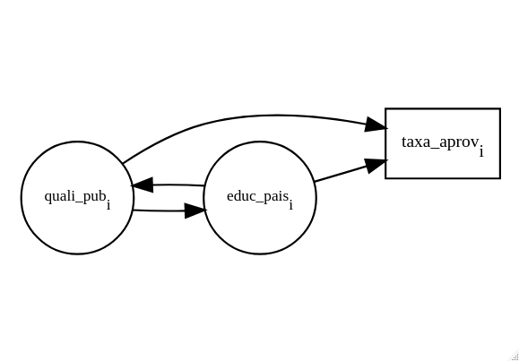

<!-- Parágrafos e espaçamento --->

```{=tex}
\onehalfspacing
\justifying
\setlength{\parindent}{0cm}
\setlength{\parskip}{0.1cm}
\FloatBarrier
```
<!-- Remover tudo menos os resultados dos chunks --->

```{r, echo=FALSE}
knitr::opts_chunk$set(error=FALSE, warning=FALSE, message=FALSE)
```

# Lista 3 {.unnumbered}

(Texto para as questões 1 a 3) Os governos dos estados brasileiros estão interessados em implementar ações com o intuito de melhorar a taxa de aprovação (ou de não-repetência) dos alunos de escolas estaduais. Resultados de estudos econométricos previamente realizados apontam que a qualidade da escola pública em que foi cursado o ensino fundamental é uma das principais causas do desempenho do aluno no ensino médio. Seja assumido que é possível obter, a partir dos dados disponíveis, uma medida razoavelmente precisa para a qualidade das escolas públicas, denotada por "quali_pub". Também será assumido que os governos estaduais são capazes de alterar a variável em questão. Com base nisso, seja, por simplicidade, considerada uma política pública estadual que procura aumentar a taxa de aprovação explorando, para isso, a via de aumento da qualidade das escolas públicas de ensino fundamental. Você foi contratado para estimar o impacto provável desta política como subsídio à decisão que definirá se ela vai ou não ser implementada. Os dados disponíveis compreendem três variáveis, (i) o desempenho, no ensino médio, de alunos que cursaram o ensino fundamental em escolas públicas, taxa_aprov, (ii) quali_pub, (iii) nível educacional dos pais dos alunos, educ_pais. A partir destes dados é possível estimar duas Funções de Regressão Populacional (FRPs) distintas.

-   **FRP 1:** taxa_aprov~i~ = $\alpha_{0}+\alpha_{1}$ quali_pub~i~ + e~i~
-   **FRP 2:** taxa_aprov~i~ = $\beta_{0}+\beta_{1}$ quali_pub~i~ + $\beta_{2}$ educ_pais~i~ + u~i~

Ao comparar as duas FRPs, deve-se levar em conta a existência de correlação entre quali_pub e educ_pais, justificada pela conjectura de que a capacidade de selecionar a melhor escola para os filhos é diretamente proporcional ao nível educacional. Além disso, há evidência de que o desempenho no ensino médio é positivamente correlacionado com a educação dos pais.

## 1) {.unnumbered}

*No enunciado acima, há três relações que conectam as três variáveis. Represente essas relações a partir de um diagrama de flechas tal como o que consta na nota de aula 4. Para isso, considere duas convenções, quais sejam: (a) a causalidade deve ser indicada com uma flecha unidirecional,* $\rightarrow$*, em cujo início está a variável-causa e, em, cujo término, a variável-consequência e; (b) a correlação deve ser indicada com uma flecha bidirecional ,"*$\leftrightarrow$*".*

```{r echo = F, results = F}
# install.packages("DiagrammeR")

library("DiagrammeR")

DiagrammeR::grViz("
  digraph boxes_and_circles {
    
    rankdir=LR;
  
    graph [overlap = true, fontsize = 10]
  
    node [shape = box, fontsize = 10]
    a[label = <taxa_aprov<SUB>i</SUB>>]
  
    node [shape = circle,
          fixedsize = true,
          width = 0.9,
          fontsize = 10]
    b[label = <quali_pub<SUB>i</SUB>>]; c[label = <educ_pais<SUB>i</SUB>>]
  
    b -> a
    c -> a
    b -> c
    c -> b
  }
")
```

\Centering

{width="400"}

\justifying

\setlength{\parindent}{0cm}

## 2) {.unnumbered}

*Explique porque o coeficiente* $\beta_{1}$ *é uma medida mais adequada do que o coeficiente* $\alpha_{1}$ *para o impacto da política pública. Tome por base (i) o diagrama elaborado na questão anterior e (ii) a interpretação ceteris paribus da regressão múltipla.*

## 3) {.unnumbered}

*O que ocorreria caso os resultados da estimação da FRP 1 fossem tomados por base para decidir quanto à implementação da política?*

## 4) {.unnumbered}

*Uma medida para a discriminação de gênero no mercado de trabalho é dada pela estimativa pontual para o parâmetro* $\delta$ *na FRP a seguir, em que W~i~ é o salário recebido pelo i-ésimo indivíduo, "educ" capta o nível educacional e X contém variáveis explicativas socioeconômicas adicionais. Os indivíduos que declararam possuir sexo masculino são indicados com d_mas = 1, e indivíduos que declararam possuir sexo feminino como d_mas = 0.*

$$
\log (W_i)=\beta_{0}+\beta_{1} \text{educ}_i+\beta_{3} X_i+\delta \text{d\_mas}_i
$$

*Argumente porque a estimativa pontual de* $\delta$ *é uma medida para a porção do diferencial salarial associada à discriminação de gênero. Embase sua resposta no conceito do coeficiente de uma variável binária.*

## 5) {.unnumbered}

*Um pesquisador estimou uma FRP em que a variável dependente é o tempo de internação hospitalar, devida a doenças respiratórias, de idosos com pelo menos 65 anos. Foram considerados 763 municípios da Amazônia Legal brasileira. A FPR estimada correspondeu à: dias_leito =* $\beta_{0}+\beta_{1}$*idade_média~i~ +* $\beta_{2}$*DCNT~i~ +* $\beta_{3}$*PIB~i~ + u~i~, a qual será referida, doravante, como "equação original". A primeira explicativa é a idade média da população municipal, DNCT* $\equiv$ *mortalidade devido a doenças crônicas não-transmissíveis, uma medida do nível de saúde da população e PIB* $\equiv$ *produto interno bruto municipal, uma medida para a capacidade de contratar serviços de saúde e comprar medicação. Uma vez obtidos os resultados, o pesquisador decidiu fazer um teste, ampliando a FRP com a inclusão do Índice de Desenvolvimento Humano municipal (IDH). Os resultados seguem na tabela abaixo. Explique porque, mesmo sendo a soma dos quadrados dos resíduos (SQR) inferior na equação ampliada, esta apresentou o mesmo R^2^ ajustado.*

| Estatística / FRP         |   Sem IDH    |   Com IDH    |
|:--------------------------|:------------:|:------------:|
| SQE                       | 3.047.142,10 | 3.047.833,81 |
| SQR                       |  393.843,77  |  393.152,06  |
| SQT                       | 3.440.985,87 | 3.440.985,87 |
| Graus de liberdade da SQR |     759      |     758      |
| Graus de liberdade da SQT |     762      |     762      |
| R^2^ ajustado             |    0,8851    |    0,8851    |

## 6) {.unnumbered}

*Quais dos seguintes itens podem fazer que os estimadores de MQO sejam enviesados? Explique sua escolha.*

-   *a. Heterocedasticidade*
-   *b. Omitir uma variável importante*
