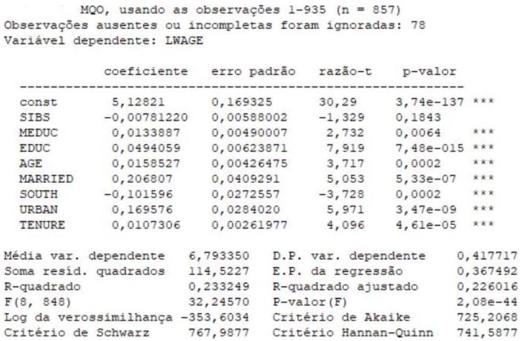

<!-- Parágrafos e espaçamento --->

```{=tex}
\onehalfspacing
\justifying
\setlength{\parindent}{0cm}
\setlength{\parskip}{0.1cm}
\FloatBarrier
```
<!-- Remover tudo menos os resultados dos chunks --->

```{r, echo=FALSE}
knitr::opts_chunk$set(error=FALSE, warning=FALSE, message=FALSE)
```

# Lista 4

## 1)

*Encontram-se na tabela abaixo as estimativas pontuais e erros-padrão obtidos pelo método de mínimos quadrados ordinários para a FRP em que o logaritmo do salário é a variável dependente.*

| Parâmetro                             | Estimativa pontual | Erro-padrão |
|---------------------------------------|--------------------|-------------|
| Intercepto                            | 0,6                | 0,201       |
| Sindicato (coeficiente)               | 0,175              | 0,1         |
| Sexo masculino (coeficiente)          | 0,09               | 0,05        |
| Educação (coeficiente)                | 0,08               | 0,032       |
| Experiência (coeficiente)             | 0,03               | 0,009       |
| Experiência ao quadrado (coeficiente) | -0,003             | 0,001       |

*O R^2^ não ajustado foi de 0,36. Em que educação e experiência correspondem, respectivamente, ao número de anos de estudo e experiência profissional, "sindicato" é uma variável binária indicando participação no sindicato, e "sexo masculino" indica tal característica. Todas as suposições usuais (Gauss-Markov) acerca do modelo de regressão linear clássico são satisfeitas, inclusive a de normalidade do termo de perturbação, e, portanto, dos estimadores de MQO. Leve em conta que uma variável aleatória Z com distribuição normal padrão é tal que P(\|Z\| \> 1,65) = 0,10 e P(\|Z\| \> 1,96) = 0,05. Julgue as afirmativas abaixo como verdadeira ou falsa e justifique sua resposta:*

-   [ ] *É possível rejeitar, ao nível de significância de 5%, a hipótese nula de que os salários de trabalhadores sindicalizados e não sindicalizados são iguais. A hipótese alternativa é que os trabalhadores sindicalizados ganham mais do que os não sindicalizados.* $$
      \hat t(H_0) = 0{,}175/\sqrt{0{,}1} \approx 0{,}553,\ -1{,}96 < 0,553 < 1{,}96
      $$ Falso, pois não é possível rejeitar a hipótese nula.

-   [ ] *Se incluirmos uma explicativa adicional entre as variáveis explicativas, o R^2^ não ajustado aumentará, obrigatoriamente.\
    *Falso, pois o R^2^ não ajustado pode não aumentar caso a contribuição de uma variável independente para a variância da variável independente seja nula.

-   [x] *Supondo que o tamanho da amostra seja 206, é possível rejeitar, ao nível de significância de 5%, a hipótese de que os coeficientes da regressão, com exceção do intercepto, são simultaneamente iguais a zero. Considerar que P(F~5,206~ > 2,25) = 0,05.\
    *$$
    \hat F(H_0) = \frac{0{,}36/5}{(1-0{,}36)/[206-(5+1)]} \approx 22{,}5>2{,}25
    $$\
    Verdadeiro, é possível rejeitar a hipótese nula.

## 2)

*A tabela a seguir apresenta os resultados da estimação da demanda por água (variável dependente) na escala de regiões de abastecimento hídrico em que a Alemanha foi dividida. Todas as variáveis estão em forma logarítmica.*

### 2) a.

*Considerando testes de significância individual bicaudais, preencha a quinta coluna com a seguinte simbologia:*

-   *Explicativa significativa a 1% ou menos: `**`*
-   *Explicativa significativa a 5%: `*`*
-   *Explicativa significativa a 10%: `+`*
-   *Explicativa não significativa: NS*

\small

|                                             | Estimativa pontual | Desvio padrão | Estatística t | Simbologia para a significância estatística |
|---------------------------------------------|:------------------:|:-------------:|:-------------:|:-------------------------------------------:|
| Preço da água                               |       -0,24        |     0,06      |    -4,1724    |                    \*\*                     |
| Renda                                       |       30,66        |     12,72     |    2,4097     |                     \*                      |
| Renda^2^                                    |       -1,56        |     0,65      |    -2,3942    |                     \*                      |
| Tamanho                                     |       -0,44        |     0,18      |    -2,4357    |                     \*                      |
| Idade                                       |        0,60        |     0,33      |    1,8328     |                     \+                      |
| Fracão de domicílios com poços              |       -0,01        |     0,01      |    -2,3333    |                     \*                      |
| Fracão de domicílios com apenas uma família |        0,07        |     0,07      |    1,1231     |                     NS                      |
| Número médio de dias com chuva              |       -0,15        |     0,09      |    -1,6704    |                     \+                      |
| Temperatura média                           |       -0,05        |     0,16      |    -0,2866    |                     NS                      |
| Intercepto                                  |      -146,83       |     62,12     |    -2,3636    |                     \*                      |

\normalsize

*As regiões críticas para os testes a 1%, 5% e 10% são:*

-   *RC(1%):* $[-\infty;-2{,}584] \cup [2{,}584;\infty]$
-   *RC(5%):* $[-\infty;-1{,}964] \cup [1{,}964;\infty]$
-   *RC(10%):* $[-\infty;-1{,}647] \cup [1{,}647;\infty]$

\scriptsize

```{r message=FALSE, warning=FALSE, paged.print=TRUE}
# install.packages("tidyverse")
library(tidyverse)

df <- tibble::tibble(t = c(-4.1724,2.4097,-2.3942,-2.4357,
                           1.8328,-2.3333,1.1231,-1.6704,
                           -0.2866,-2.3636))

df |> 
  dplyr::mutate(sig = case_when((t > 2.584 | t < -2.584) ~ "**",
                                (t > 1.964 | t < -1.964) & t != "**" ~ "*",
                                (t > 1.647 | t < -1.647) & (t != "**" | t != "*") ~ "+",
                                (t != "**" & t != "*" & t != "+") ~ "NS"))
```

\normalsize

### 2) b.

*Com base nos dados da tabela da questão 3, aplique o teste de significância global a 5%, preenchendo as lacunas a seguir.*

-   *Reporte o valor da estatística do teste.*

$$
    \hat F(H_0) = \frac{0{,}233/8}{(1-0{,}233)/[857-(8+1)]} \approx 32{,}201
  $$

-   *Reporte o valor crítico.*

```{r}
c(qf(0.025, 8, 857-(8+1), lower.tail = T), 
  qf(0.975, 8, 857-(8+1), lower.tail = F))
```

-   *Decida: é correto rejeitar a hipótese nula (preencha a lacuna com "sim" ou "não")?\
    *É correto rejeitar H~0~, pois F está dentro da região crítica $[-\infty;0{,}272]\cup[2{,}20;\infty]$
-   *O que se pode concluir com base no item anterior?\
    *Que os coeficientes da regressão estimada na tabela da regressão 3 não são todos nulos.

## 3)

*A tabela abaixo lista variáveis independentes de um estudo sobre os determinantes do salário no mercado de trabalho. Trata-se de uma regressão em que logaritmo do salário é explicado, conforme a tabela, em função de três categorias de fatores explicativos: (i) características da família, (ii) características do indivíduo, (iii) localização regional e (v) características do emprego.*

| Variável                         | Categoria | Nome sucinto |
|----------------------------------|-----------|--------------|
| Número de irmãos                 | Família   | *sibs*       |
| Educação da mãe                  | Família   | *meduc*      |
| Educação do trabalhador          | Indivíduo | *educ*       |
| Idade do trabalhador             | Indivíduo | *age*        |
| Estado civil casado              | Indivíduo | *married*    |
| Emprego na região sul ou sudeste | Região    | *south*      |
| Emprego em área urbana           | Região    | *urban*      |
| Tempo de emprego                 | Emprego   | *tenure*     |

*Na figura a seguir se encontram os resultados da estimação por mínimos quadrados ordinários da FRP em questão. Notar que o número de observações é N = 857.*

\Centering

{width="450"}

\justify

\setlength{\parindent}{0cm}

*Uma forma de verificar o efeito conjunto das variáveis explicativas de uma dada categoria é a partir de um teste de restrição de exclusão em que a hipótese nula é a de que os coeficientes de todas as explicativas da categoria são nulos.*

### 3) a.

*Descreva, em detalhe, os estágios do procedimento que tem de ser conduzido para realizar o teste de significância conjunta das explicativas pertencentes à categoria "Família". Leve em conta, para isso, que a estatística do teste é composta por duas estatísticas. Assuma que cada uma destas duas estatísticas tem de ser gerada a partir de uma regressão específica. (Dica: o teste F usa a SQR das regressões auxiliares)*

### 3) b.

*Conclua a aplicação do teste F aos valores das estatísticas correspondentes a cada categoria, preenchendo a tabela abaixo. Para isso use compare a informação do valor da estatística de teste com os valores críticos obtidos de uma tabela da distribuição F ou a partir da função `qf(0.95, glnum, gldenom)` do R, em que glnum = graus de liberdade do numerador e gldenom = graus de liberdade do denominador).*

| Categoria | Valor da estatística do teste | Graus de liberdade do numerador | Valor crítico | p-valor | Rejeitar a hipótese nula (S/N)? |
|:---------:|:-----------------------------:|:-------------------------------:|:-------------:|:-------:|:-------------------------------:|
|  Família  |            5,69104            |                                 |               |         |                                 |
| Indivíduo |            34,7045            |                                 |               |         |                                 |
|  Região   |            27,4857            |                                 |               |         |                                 |
|  Emprego  |            16,7773            |                                 |               |         |                                 |

### 3) c.

*Com base na figura acima em que se encontram os resultados de estimação, calcule os limites de intervalos com o nível de confiança de 95% para o valor populacional do coeficiente da explicativa "educação do trabalhador".*

### 3) d.

*Ao rodar a regressão com todas as explicativas listadas na tabela ao início da questão, um pesquisador observou que uma das variáveis referentes à família é não-significativa. Há contradição entre o resultado do teste de restrição de exclusão para a categoria "família" e o resultado dos testes de significância individual? Explique em detalhe.*

### 3) e.

*O mesmo pesquisador observou que o p-valor do teste t da variável tempo de emprego é o mesmo p-valor do teste de exclusão das variáveis referentes ao emprego. O mesmo não ocorre com variáveis explicativas de outras categorias. Há contradição entre o resultado do teste de restrição de exclusão e o resultado dos testes de significância individual? Explique em detalhe.*

## 4)

*Com base nos dados dos exercícios anteriores, calcule os limites de intervalos com nível de confiança de 95% para os valores populacionais dos seguintes parâmetros:*

-   *Coeficiente da explicativa "Número médio de dias com chuva" na equação do exercício 2.*
-   *Coeficiente da explicativa "renda" na equação do exercício 2.*

## 5)

*A tabela 1 apresenta parte dos resultados da estimação de duas equações que explicam a extensão de terra ocupada com plantações de soja e com floresta em microrregiões brasileiras. Considerando (i) testes de significância individual bicaudais e (ii) o teste de significância global com base na estatística F, preencha a quarta e a sétima colunas com a seguinte simbologia:*

-   *Explicativa significativa a 1% ou menos: "1"*
-   *Explicativa significativa a 5% mas não significativa a 1%: "5"*
-   *Explicativa significativa a 10% mas não significativa a 5% e nem a 1%: "10"*
-   *Explicativa não significativa a 10% ou a 5% ou a 1%: "N"*

*Atenção: não deixe de realizar o teste de significância global com base na estatística F.*

```{=tex}
\begin{table}[H]
\scriptsize
\centering
\begin{tabular}{@{}lcccccc@{}}
\toprule
 & \multicolumn{3}{c}{Área de soja} & \multicolumn{3}{c}{Área de floresta} \\ \midrule
 & Pontual & Estatística t & Simbologia (1) & Pontual & Estatística t & Simbologia (2) \\
Preço de soja & 75507,32 & 1,91 &  & 21558,51 & 0,37 &  \\
Preço de Milho & -96696,39 & -1,79 &  & 22104,52 & 0,28 &  \\
Preço de Cana-de-açúcar & 37809,36 & 0,76 &  & 3231 & 0,04 &  \\
Preço de outras culturas & -2,22 & -2,17 &  & -0,96 & -0,67 &  \\
Preço de produtos florestais & -22900,91 & -0,54 &  & -30751,86 & -0,5 &  \\
Preço da terra & 211,67 & 0,07 &  & -595,98 & -0,13 &  \\
Preço do trabalho & 1631,84 & 1,92 &  & -3058,7 & -2,39 &  \\
Temperatura Dez-Jan-Fev & -69747,35 & -3,06 &  & -204012,7 & -5,94 &  \\
Temperatura Mar-Abr-Mai & 100732,6 & 3,67 &  & 125784,4 & 3,03 &  \\
Temperatura Jun-Jul-Ago & -65328,65 & -3,17 &  & -63404,51 & -2,04 &  \\
Temperatura Set-Out-Nov & 39707,11 & 2,12 &  & 87761,32 & 3,11 &  \\
Precipitação Dez-Jan-Fev & -2101,58 & -6,47 &  & -1666,68 & -3,41 &  \\
Precipitação Mar-Abr-Mai & 2475,95 & 7,39 &  & 2132,62 & 4,23 &  \\
Precipitação Jun-Jul-Ago & -1082,5 & -3,35 &  & -1508,05 & -3,09 &  \\
Precipitação Set-Out-Nov & 1760,4 & 5,07 &  & 2090,6 & 4 &  \\
Área total & 0,05 & 8,17 &  & 0,31 & 34,6 &  \\
\begin{tabular}[c]{@{}l@{}}Valor médio da variável \\ dependente na vizinhança\end{tabular} & 0,1 & 3,32 &  & -0,01 & -1,1 &  \\
Constante & -283682,7 & -1,45 &  & 1150425 & 3,9 &  \\
\begin{tabular}[c]{@{}l@{}}Estatística F \\ (significância global)\end{tabular} & \multicolumn{3}{c}{25,17} & \multicolumn{3}{c}{163,83} \\
\begin{tabular}[c]{@{}l@{}}Número total de \\ explicativas (K)\end{tabular} & \multicolumn{3}{c}{17} & \multicolumn{3}{c}{17} \\ \midrule
N & \multicolumn{3}{c}{558} & \multicolumn{3}{c}{558}
\end{tabular}
\end{table}
```
## 6)

Visando aplicar a decomposição de Oaxaca ao mercado de trabalho do Estado de São Paulo, um pesquisador estimou quatro regressões. Cada uma delas se refere a um subgrupo amostral definido em função de gênero e etnia, conforme a tabela abaixo detalha. Antes de proceder ao cálculo dos componentes discriminatórios dos diferenciais salariais, o pesquisador decidiu realizar uma série de testes de hipóteses. Entre eles, o de a significância conjunta (restrições de exclusão) das três medidas de setor de atividade, `d_indu`, `d_serv` e `d_apub`. Trata-se, portanto, do teste definido pelas seguintes hipóteses:

$$
\begin{aligned}
H_0:\ &\beta_\text{d\_indu}=0,\ \beta_\text{d\_serv}=0,\ \beta_\text{d\_apub}=0 \\
H_1:\ &\beta_\text{d\_indu}\ne 0\text{ ou }\beta_\text{d\_serv}\ne 0\text{ ou }\beta_\text{d\_apub}\ne 0
\end{aligned}
$$

### 6) a.

*Os valores da estatística F e respectivos graus de liberdade, para as regressões referentes a cada um dos quatro subgrupos amostrais, constam na tabela abaixo. Preencha as duas últimas linhas da tabela. Considere para isso um nível de significância de 1%. Utilize o software R para obter os valores críticos. Na última linha da tabela 2, marque "S" caso o valor da estatística F seja desfavorável, a um nível de significância de 1%, à hipótese nula e marque "N" se o valor da estatística F for favorável à hipótese nula.*

|  Resultado do teste/Subgrupo amostral  | Gênero: masculino, Etnia: branca | Gênero: masculino, Etnia: não branca | Gênero: feminino, Etnia: branca | Gênero: feminino, Etnia: não branca |
|:--------------------------------------:|:--------------------------------:|:------------------------------------:|:-------------------------------:|:-----------------------------------:|
|                   F                    |              23,672              |                16,923                |             2,9408              |               0,7402                |
| Graus de liberdade do denominador de F |               3682               |                 2542                 |              3413               |                2061                 |
|       Valor crítico (preencher)        |                                  |                                      |                                 |                                     |
|    Significativo (S/N) (preencher)     |                                  |                                      |                                 |                                     |

: Resultados dos testes de significância conjunta para as três medidas setoriais por subgrupos amostrais de gênero e etnia

### 6) b.

*A tabela abaixo se refere ao teste de multiplicador de Lagrange. Preencha as duas últimas linhas da tabela abaixo a um nível de significância de 1%. Utilize o R para obter valores críticos. Na última linha, marque "S" caso o valor da estatística F seja desfavorável, a um nível de significância de 1%, à hipótese nula e marque "N" se o valor da estatística F for favorável à hipótese nula.*

| Resultado do teste / subgrupo amostral | Gênero: masculino, Etnia: branca | Gênero: masculino, Etnia: não branca | Gênero: feminino, Etnia: branca | Gênero: feminino, Etnia: não branca |
|:--------------------------------------:|:--------------------------------:|:------------------------------------:|:-------------------------------:|:-----------------------------------:|
|               $\chi^{2}$               |             69,83372             |               49,94858               |            8,821916             |              3,682072               |
|           Graus de liberdade           |                                  |                                      |                                 |                                     |
|       Valor crítico (preencher)        |                                  |                                      |                                 |                                     |
|    Significativo (S/N) (preencher)     |                                  |                                      |                                 |                                     |

### 6) c.

*O que se pode concluir com base nos resultados dos testes de significância conjunta?*
