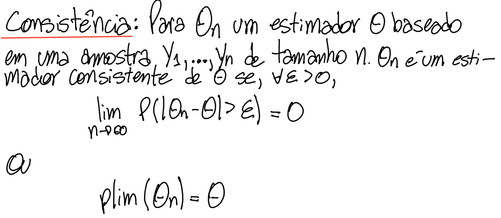
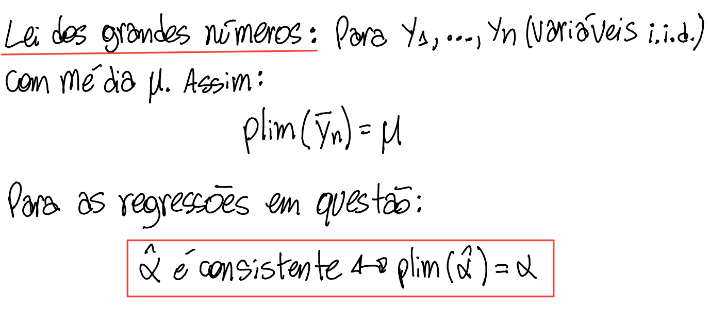
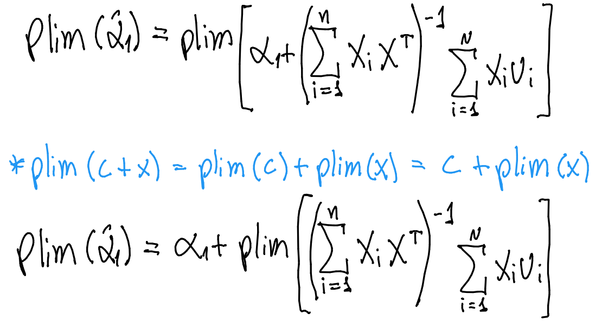
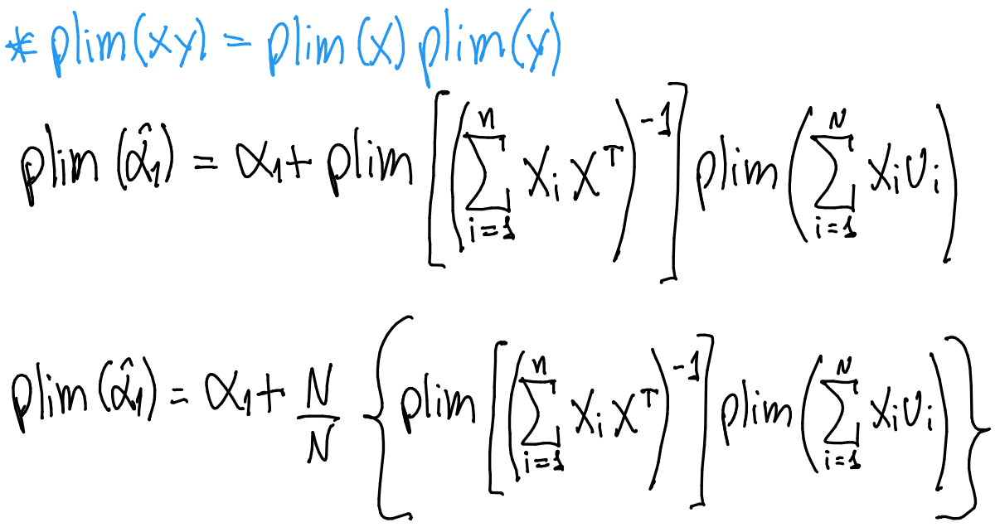
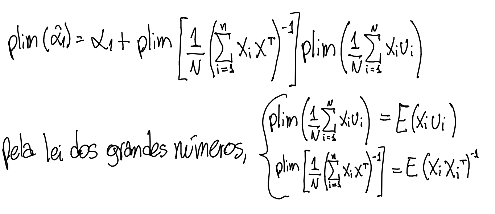
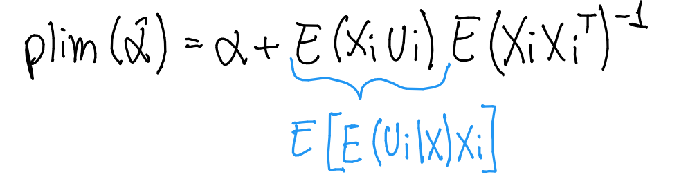

<!-- Parágrafos e espaçamento --->

```{=tex}
\onehalfspacing
\justifying
\setlength{\parindent}{0cm}
\setlength{\parskip}{0.1cm}
\FloatBarrier
```
<!-- Remover tudo menos os resultados dos chunks --->

```{r, echo=FALSE}
knitr::opts_chunk$set(error=FALSE, warning=FALSE, message=FALSE)
```

# Lista 5

## 1)

*Para resolver essa questão utilize, no R, o objeto `db_covs`, ou, em outro software, o arquivo `dados_db_covs.txt`.*

\scriptsize

```{r echo=TRUE, message=FALSE, warning=FALSE, paged.print=FALSE}
# install.packages("tidyverse")
# install.packages("estimatr")
# install.packages("car")
# install.packages("fastDummies")
# install.packages("knitr")

library(tidyverse)
library(estimatr)
library(car)
library(fastDummies)
library(knitr)

load("listas/lista_5/lista_5_dados.Rdata")
```

\normalsize

### 1) a.

*Aplique o procedimento do teste do multiplicador de Lagrange (nota de aula 7) aos quatro testes de restrições de exclusão discriminados na tabela abaixo, preenchendo-a. Adote o nível de significância de 5%.*

\scriptsize

```{r tidy=FALSE}
# criando dummies

db_covs <- fastDummies::dummy_columns(
  db_covs,
  select_columns = "Continent",
  remove_first_dummy = T, # criando n-1 dummies
  remove_selected_columns = T) # removendo a coluna que gerou as dummies
  
db_covs <- db_covs |>   
  tibble::as_tibble() |> 
  dplyr::rename(d_asia = Continent_Asia,
                d_europe = Continent_Europe,
                d_n_america = Continent_NorthAmer,
                d_oceania = Continent_Oceania,
                d_s_america = Continent_SouthAmer)

# estimando regressão

eq <- obitos_por_milhao ~ 
  casos_por_milhao + fem_head + fertility_ +
  airpoll_exposure_ + d_lockdown + d_asia + 
  d_europe + d_n_america + d_oceania + 
  d_s_america

modelo <- estimatr::lm_robust(eq,
                              data = db_covs,
                              se_type = "classical")

# testando significância conjunta - características nacionais

h0 <- c("fem_head = 0", 
        "fertility_ = 0", 
        "d_lockdown = 0")

lm_test <- car::linearHypothesis(modelo, 
                      h0, 
                      test ="Chisq")

stat_test_1 <- round(lm_test$Chisq[2], 2) # estatística de teste
pvalor_1 <- round(lm_test$`Pr(>Chisq)`[2], 2) # p-valor
vcrit_1 <- round(qchisq(0.05, 3, lower.tail = F), 2) # valor crítico

# testando significância conjunta - exposição à causas da doença

h0 <- c("airpoll_exposure_ = 0", 
        "casos_por_milhao = 0")

lm_test <- car::linearHypothesis(modelo, 
                      h0, 
                      test ="Chisq")

stat_test_2 <- round(lm_test$Chisq[2], 2) # estatística de teste
pvalor_2 <- round(lm_test$`Pr(>Chisq)`[2], 2) # p-valor
vcrit_2 <- round(qchisq(0.05, 2, lower.tail = F), 2) # valor crítico

# testando significância conjunta - continente

h0 <- c("d_asia = 0", 
        "d_europe = 0", 
        "d_n_america = 0", 
        "d_oceania = 0", 
        "d_s_america = 0")

lm_test <- car::linearHypothesis(modelo, 
                      h0, 
                      test ="Chisq")

stat_test_3 <- round(lm_test$Chisq[2], 2) # estatística de teste
pvalor_3 <- round(lm_test$`Pr(>Chisq)`[2], 2) # p-valor
vcrit_3 <- round(qchisq(0.05, 5, lower.tail = F), 2) # valor crítico
```

|          Categoria           |                                 Variáveis                                  | Valor da estatística do teste | Graus de liberdade | Valor crítico |   p-valor    | Rejeitar H~0~ (S/N)? |
|:----------------------------:|:--------------------------------------------------------------------------:|:-----------------------------:|:------------------:|:-------------:|:------------:|:--------------------:|
|  Características nacionais   | País é dirigido por mulher, taxa de fertilidade, lockdown foi implementado |        `r stat_test_1`        |         3          |  `r vcrit_1`  | `r pvalor_1` |          N           |
| Exposição à causas de doença |          Exposição à poluição atmosférica, infecções por COVID-19          |        `r stat_test_2`        |         2          |  `r vcrit_2`  | `r pvalor_2` |          S           |
|          Continente          |                            Dummies continentais                            |        `r stat_test_3`        |         5          |  `r vcrit_3`  | `r pvalor_3` |          S           |

\normalsize

### 1) b.

*Responda: os resultados ora obtidos contradizem os obtidos no laboratório 1 indicando insignificância estatística da explicativa poluição atmosférica?\
\
*Não contradiz, pois o coeficiente para poluição atmosférica no teste de significância individual não é significativo, com p-valor maior que 5%. Tomada em conjunto com variáveis não significativas como `fem_head` e `fertility_`, a variável não contribui para a explicação da variância de `obitos_por_milhao`.

\footnotesize

```{r}
estimatr::tidy(modelo) |> 
  dplyr::select(term, p.value) |> 
  dplyr::filter(term == "airpoll_exposure_" |
                term == "fem_head"|
                term == "fertility_") |> 
  dplyr::mutate(alfa = dplyr::case_when(
    p.value > 0.05 ~ "N",
    TRUE ~ "S"
  )) |> 
  knitr::kable(col.names = c("Variável", 
                             "P-valor",
                             "Significativo a 5%?"))
```

\normalsize

## 2)

*Para resolver essa questão utilize, no R, o objeto `db_gee`, ou, em outro software, o arquivo `dados_db_gee.txt`.*

*Um pesquisador está interessado em estimar uma equação explicando emissões de gases de efeito estufa em função de variáveis macroeconômicas e binárias indicando nível de desenvolvimento e continente. A fórmula é a seguinte:*

\centering

geepc = $\beta_{0}$ + $\beta_{1}$ log(1 + pibpc) + $\beta_{2}$ log(1 + epc) + $\beta_{3}$ log(1 + apc) + $\beta_{4}$ d_dev_ing + $\beta_{5}$ d_dev_tra + $\beta_{6}$ d_reg_afr + $\beta_{6}$ d_reg_asi + $\beta_{7}$ d_reg_cam + $\beta_{8}$ d_reg_nam + $\beta_{9}$ d_reg_sam + $\beta_{10}$ d_reg_oce + u

```{=tex}
\justify
\setlength{\parindent}{0cm}
```
*Aplicando-se as definições na tabela abaixo:*

| Variável                                      | Categoria           | Nome sucinto |
|-----------------------------------------------|---------------------|--------------|
| Emissões de gases de efeito estufa per capita | Variável dependente | geepc        |
| PIB per capita                                | Macro               | pibpc        |
| Consumo energético per capita                 | Macro               | epc          |
| Área territorial per capita                   | Macro               | apc          |
| País em desenvolvimento                       | Desenvolvimento     | d_dev_ing    |
| País em transição                             | Desenvolvimento     | d_dev_tra    |
| Continente Africano                           | Continente          | d_reg_afr    |
| Continente Asiático                           | Continente          | d_reg_asi    |
| Continentes Americano Central e Caribenho     | Continente          | d_reg_cam    |
| Continente Americano do Norte                 | Continente          | d_reg_nam    |
| Continente Americano do Sul                   | Continente          | d_reg_sam    |
| Continente Oceania                            | Continente          | d_reg_oce    |

### 2) a.

*Como preâmbulo, estime a regressão linear simples apenas com o consumo energético per capita (*`epc`*) como variável explicativa. A partir dos resultados, preencha a tabela abaixo.*

\footnotesize

```{r}
# estimando regressão

eq_a <- geepc ~ log1p(epc)

modelo <- estimatr::lm_robust(eq_a,
                              data = db_gee,
                              se_type = "classical") 

# função para parâmetros

parametros <- function(var, col) {
  x <- modelo |>
    dplyr::filter(term == var) |> 
    dplyr::select(col) |>
    dplyr::pull() |> 
    round(2)
  
  return(x)
}

# tabela

modelo <- tibble::as_tibble(estimatr::tidy(modelo))

table_a <- tibble::tibble(var = c("(Intercept)", "log1p(epc)")) |> 
  dplyr::group_by(var) |> 
  tidyr::nest() |>
  dplyr::mutate(
    data = purrr::map(
      data,
      ~ tibble::tibble(
        col = c("estimate", "std.error", "p.value")
      )
    )
  ) |>
  tidyr::unnest(cols = c(data)) |> 
  dplyr::ungroup() |> 
  dplyr::mutate(
    value = purrr::map2_dbl(
      var,
      col,
      ~ parametros(.x, .y)
    )
  ) |> 
  tidyr::pivot_wider(names_from = col,
                     values_from = value) |> 
  dplyr::rename(`Variável` = var,
                `Estimativa` = estimate,
                `Erro padrão` = std.error,
                `P-valor` = p.value) |> 
  dplyr::mutate(`Significativo a 5%?` = dplyr::case_when(
    `P-valor` < 0.05 ~ "S",
    TRUE ~ "N"
  ))

table_a |> 
  knitr::kable()
```

\normalsize

### 2) b.

*Estime a regressão linear múltipla descrita pela fórmula acima, a qual corresponde a uma regressão "longa", ou seja, com um número considerável de explicativas. Com base nisso preencha a tabela abaixo.*

\footnotesize

```{r}
# estimando regressão

eq_b <- geepc ~ 
  log1p(epc) + log1p(pibpc) +  log1p(apc) +
  d_dev_ing + d_dev_tra + d_reg_afr +
  d_reg_asi + d_reg_cam + d_reg_nam + 
  d_reg_sam + d_reg_oce

lm(eq_b,
   data = db_gee)

modelo <- estimatr::lm_robust(eq_b,
                              data = db_gee,
                              se_type = "classical") 

# tabela

modelo <- tibble::as_tibble(estimatr::tidy(modelo))

table_b <- tibble::tibble(var = c("(Intercept)", 
                                  "log1p(epc)", "log1p(pibpc)", 
                                  "log1p(apc)", "d_dev_ing", 
                                  "d_dev_tra", "d_reg_afr", 
                                  "d_reg_asi", "d_reg_cam", 
                                  "d_reg_nam", "d_reg_sam", 
                                  "d_reg_oce")) |> 
  dplyr::group_by(var) |> 
  tidyr::nest() |>
  dplyr::mutate(
    data = purrr::map(
      data,
      ~ tibble::tibble(
        col = c("estimate", 
                "std.error", 
                "p.value")
      )
    )
  ) |>
  tidyr::unnest(cols = c(data)) |> 
  dplyr::ungroup() |> 
  dplyr::mutate(
    value = purrr::map2_dbl(
      var,
      col,
      ~ parametros(.x, .y)
    )
  ) |> 
  tidyr::pivot_wider(names_from = col,
                     values_from = value) |> 
  dplyr::rename(`Variável` = var,
                `Estimativa` = estimate,
                `Erro padrão` = std.error,
                `P-valor` = p.value) |> 
  dplyr::mutate(`Significativo a 5%?` = dplyr::case_when(
    `P-valor` < 0.05 ~ "S",
    TRUE ~ "N"
  ))

table_b |> 
  knitr::kable()
```

\normalsize

### 2) c.

*Quanto à regressão longa, responda:*

1.  *Quais variáveis são estatisticamente não-significativas?*

\footnotesize

```{r}
table_b |> 
  dplyr::filter(`Significativo a 5%?` == "N") |> 
  knitr::kable()
```

\normalsize

2.  *Há alguma variável cuja insignificância estatística é contra-intuitiva?*\
    Sim, `d_reg_sam` não ser significante é contra-qintuitivo pelo fato do Brasil ser um grande emissor de gases do efeito estufa por conta do desmatamento.

### 2) d.

*Compare os resultados das duas estimações nos itens "a" e " b" no tocante ao coeficiente do consumo energético per capita. Caso tenha havido alteração da estimativa pontual ou do valor observado da estatística t, explique por que isso ocorreu. Em sua resposta explore a diferença entre regressão simples e múltipla.*

\footnotesize

```{r}
df1 <- table_a |> 
  dplyr::mutate(Variável = dplyr::case_when(
    Variável == "log1p(epc)" ~ "log1p(epc_a)"
  )) |> 
  dplyr::slice(2)

df2 <- table_b |> 
  dplyr::mutate(Variável = dplyr::case_when(
    Variável == "log1p(epc)" ~ "log1p(epc_b)"
  )) |> 
  dplyr::slice(2)

dplyr::bind_rows(df1, df2) |> 
  knitr::kable()
```

\normalsize

A alteração na estimativa do coeficiente de uma variável se dá por conta do viés de variável omitida. Esse viés surge quando se omite uma variável explicativa x~k~ no modelo que é relevante na explicação da variação da variável dependente e é correlacionada com pelo menos uma das variáveis do modelo estimado, levando a conclusões equivocadas sobre a função de regressão populacional. Neste caso, a variável `epc` apresentou diminuição em seu coeficiente após a inclusão de variáveis de controle, possibilitando um melhor isolamento do efeito *ceteris paribus* e a mitigação do viés de variável omitida.

### 2) e.

*Compare o R^2^ ordinário da regressão simples com o R^2^ ajustado da regressão múltipla e explique por que os dois diferem em magnitude.*

\footnotesize

```{r}
modelo_a <- estimatr::lm_robust(eq_a,
                                data = db_gee,
                                se_type = "classical")

modelo_b <- estimatr::lm_robust(eq_b,
                                data = db_gee,
                                se_type = "classical")

r2_a <- round(modelo_a$r.squared, 2)

r2_b <- round(modelo_b$r.squared, 2)
```

\normalsize

-   R^2^ do modelo simples = `r r2_a`
-   R^2^ do modelo de múltiplas variáveis = `r r2_b`

O R^2^ da regressão de múltiplas variáveis é maior por seu melhor ajuste e maior capacidade explicativa da variação das emissões de gases do efeito estufa *per capita*.

### 2) f.

*Teste a hipótese de que nível de desenvolvimento explica fração irrelevante da emissão de gases de efeito estufa. Para isso aplique um teste de significância conjunta às explicativas `d_dev_ing` e `d_dev_tra`, utilizando o procedimento do teste de multiplicador de Lagrange da nota de aula 7. Em sua resposta informe:*

\footnotesize

```{r}
modelo <- estimatr::lm_robust(eq_b,
                              data = db_gee,
                              se_type = "classical")

h0 <- c("d_dev_ing = 0", 
        "d_dev_tra = 0")

lm_test <- car::linearHypothesis(modelo, 
                      h0, 
                      test ="Chisq")

stat_test <- round(lm_test$Chisq[2], 2) 
vcrit <- round(qchisq(0.05, 2, lower.tail = F), 2)
pvalor <- round(lm_test$`Pr(>Chisq)`[2], 2)
```

\normalsize

1.  *Valor observado da estatística do teste:* `r stat_test`
2.  *Valor crítico ao nível de significância de 5%:* `r vcrit`
3.  *P-valor:* `r pvalor`
4.  *Decisão apropriada entre rejeitar ou não a hipótese nula:* Sim
5.  *Qual conclusão pode ser retirada do resultado do teste? Justifique.\
    *Ao se rejeitar H~0~, pode-se aceitar H~1~ e afirmar que variáveis de desenvolvimento são relevantes para explicar as emissões de gases do efeito estufa *per capita*.

## 3)

*Ao estimar a equação de Mincer para o logaritmo natural da remuneração, foram obtidas estimativas pontuais de 0,071 e 0,026, respectivamente, para os coeficientes das explicativas captando nível educacional e experiência. Diversas outras explicativas foram incorporadas. As duas explicativas são medidas em anos e, portanto, trata-se de variáveis quantitativas discretas. Nenhuma delas foi incorporada ao modelo em forma logarítmica, mas sim em nível, i.e., sem qualquer transformação matemática de seus valores originais. Tendo em mente estes detalhes e também a definição do conceito do coeficiente de uma explicativa discreta, interprete economicamente, com a máxima clareza e precisão possíveis, os valores das estimativas pontuais, i.e., explique o significado econômico das estimativas pontuais considerando não apenas os sinais delas, mas também as magnitudes. Para isso, utilize a aproximação* $\log (1+w) \approx w$.

A interpretação dos parâmetros para nível educacional e experiência equivale a uma semielasticidade, ou seja:

-   O aumento de um ano no nível educacional equivale a um aumento de 7,1% na remuneração.
-   O aumento de um ano na experiência do trabalhador equivale a um aumento de 2,6% na remuneração.

## 4)

*Seja reconsiderado o problema de estimar o efeito da qualidade do ensino fundamental no desempenho no ensino médio, estudado na lista 3. Há duas especificações possíveis, sendo apenas a segunda a FRP verdadeira.*

-   FRP~1~: taxa_aprov~i~ = $\alpha_{0}$ + $\alpha_{1}$ quali_pub~i~ + e~i~
-   FRP~2~: taxa_aprov~i~ = $\beta_{0}$ + $\beta_{1}$ quali_pub~i~ + $\beta_{2}$ educ_pais~i~ + u~i~

*Demonstre que a estimação da FRP 1 é sujeita à inconsistência, assumindo, em conformidade com a lista 3, que a covariância populacional entre `quali_pub` e `educ_pais` é não-nula. A solução pode ser apresentada tanto com notação não matricial como com notação matricial. Sendo a última utilizada, haverá acréscimo de meio ponto à nota final dessa questão.*

\centering

{width="150"}

{width="400"}

{width="400"}

{width="400"}

{width="400"}

{width="400"}

{width="350"}

```{=tex}
\justify
\setlength{\parindent}{0cm}
```

MCRL4 não pode ser utilizada neste caso, pois:

-   $cov(A, B) \ne 0$

-   A variável omitida na FRP~1~ compõe o termo de erro u~i~

Logo, $E[E(u_i|X) x_i] \ne 0$, o que implica que $plim(\hat \alpha) \ne \alpha$, sendo $\hat\alpha_1$ um estimador inconsistente.
