<!-- Parágrafos e espaçamento --->

```{=tex}
\onehalfspacing
\justifying
\setlength{\parindent}{0cm}
\setlength{\parskip}{0.1cm}
\FloatBarrier
```
<!-- Remover tudo menos os resultados dos chunks --->

```{r, echo=FALSE}
knitr::opts_chunk$set(error=FALSE, warning=FALSE, message=FALSE)
```

# Prova 1 {.unnumbered}

## 1) {.unnumbered}

*Ao final da década de 90, houve uma expressiva valorização do Real, e há um debate acerca das consequências para a indústria brasileira. O efeito da valorização sobre o investimento industrial é ambíguo. Por um lado, a valorização exerce influência positiva sobre o investimento, barateando importações de bens de capital. Por outro lado, a valorização exerce influência negativa, reduzindo a rentabilidade das exportações de manufaturados. A teoria, pois, não permite concluir quanto ao efeito líquido destas duas influências, ele pode ser positivo ou negativo. Seja I~i0~ o valor real do investimento realizado pela i-ésima empresa industrial antes da valorização e I~i1~ o valor deste investimento após a valorização. Com base em uma amostra de 81 (9^2^) empresas industriais, coletada no período a que este enunciado se refere, é possível testar, a um nível de significância de 10%, a hipótese de que a média populacional para a variação do investimento foi nula no período (ou seja, para a empresa média, efeitos positivo e negativo cancelaram-se). O valor observado, na amostra, da média para o indicador de impacto,* $\bar \theta = \frac{1}{N} \sum_{i=1}^{N} \delta_{i}=\frac{1}{N} \sum_{i=1}^{N}\left(\frac{I_{i 1}-I_{i 0}}{I_{i 0}}\right)$*, é de ‑ 0,3, com desvio padrão* $s =\sqrt{\frac{1}{N-1} \sum_{i=1}^{N}\left(\delta_{i}-\bar{\delta}\right)^{2}}$ *= 1,5. Preencha as lacunas abaixo:*

### 1) a. {.unnumbered}

*Calcule o valor observado da estatística do teste:*

\footnotesize

```{r}
t <- (-0.3-0)/(1.5/9)
t
```

\normalsize

### 1) b. {.unnumbered}

*Apresente a região crítica do teste e o p-valor do teste:*

Para $\alpha=0{,}1$:

\footnotesize

```{r}
c(qt((0.1/2), 80), qt(1-((0.1/2)), 80))

2*pt(t, 80, lower.tail = TRUE)
```

\normalsize

### 1) c. {.unnumbered}

*Decida quanto à hipótese nula:*

-   H~0~: $\theta=0$

-   H~1~: $\theta \ne 0$

Como a estatística de teste caiu dentro da região crítica, rejeita-se H~0~ e admite-se que $\theta$ é diferente de 0 a um nível de significância de 10%.

### 1) d. {.unnumbered}

*Explique a implicação da decisão anterior para o debate acerca das consequências para a indústria brasileira:*

Rejeita-se a hipótese de que *a* média populacional para a variação do investimento foi nula no período, havendo a possibilidade de variações positivas ou negativas na taxa de investimento pós-valorização da moeda.

### 1) e. {.unnumbered}

*Informe os limites inferior e superior do intervalo com nível de confiança de 90% para o indicador de impacto.*

\footnotesize

```{r}
t <- qt(1-((0.1/2)), 80, lower.tail = F)

c((-0.3-t*(1.5/9)), (-0.3+t*(1.5/9)))
```

\normalsize

## 2) {.unnumbered}

*Em cada um dos quatro itens a seguir há pelo menos um dos passos lógicos que compõem o procedimento de simplificação da variância do estimador de mínimos quadrados ordinários para o coeficiente de uma função de regressão populacional. Selecione a alternativa que descreve corretamente a definição, propriedade ou hipótese que justifica o passo lógico indicado pelo símbolo (?). Justifique sua resposta.*

### 2) a. {.unnumbered}

$$
Var\left(\hat{\beta}_{1}|X\right)=E\left\{\left[\hat{\beta}_{1}-E\left(\hat{\beta}_{1}|X\right)\right]^{2} \mid X \right\}=(?)= E\left[\left(\hat{\beta}_{1}-\beta_{1}\right)^{2} \mid X\right]
$$

-   [ ] *(A) Propriedade de ausência de viés do estimador para o intercepto*

-   [x] *(B) Propriedade de ausência de viés do estimador para o coeficiente*

-   [ ] *(C) Definição do estimador*

\Centering

{width="350"}

{width="350"}

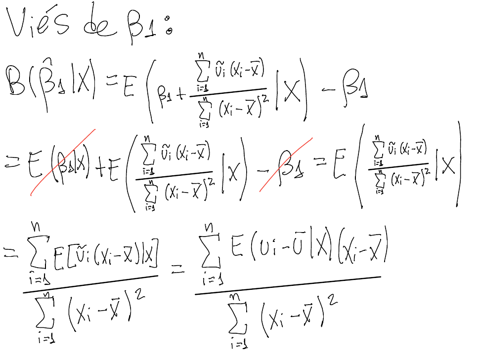{width="350"}

{width="350"}

```{=tex}
\justifying
\setlength{\parindent}{0cm}
```
Portanto, $E(\hat\beta_1|X)=\beta_1$, o que justifica a passagem.

### 2) b. {.unnumbered}

$$
Var(\hat \beta_1|X) = E[(\hat \beta_1-\beta_1)^2|X]=(?)=E\left\{\left[\frac{\sum^N_{i=1}u_i(x_i-\bar x)}{\sum^N_{i=1}(x_i-\bar x)^2}\right]^2\Bigg |\ X\right\}
$$

-   [ ] *(A) O estimador do intercepto é aproximadamente equivalente à covariância amostral, exceto pela multiplicação pelo termo de perturbação*

-   [x] *(B) Fórmula do estimador do coeficiente*

-   [ ] *(C) Ausência de viés para o estimador do coeficiente*

\Centering

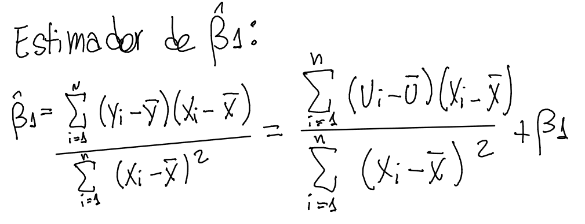{width="350"}

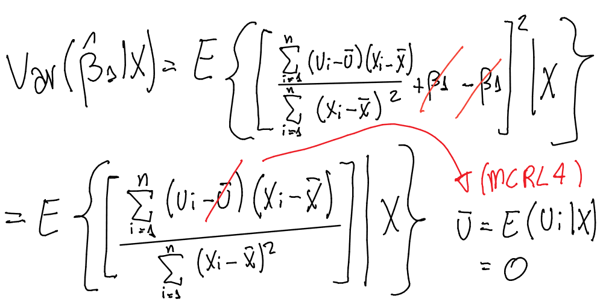{width="350"}

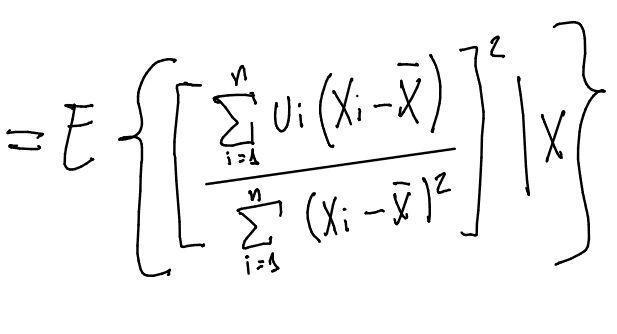{width="250"}

\justifying

### 2) c. {.unnumbered}

$$
\begin{aligned}
Var(\hat \beta_1|X) &= E\left\{\left[\frac{\sum^N_{i=1}u_i(x_i-\bar x)}{\sum^N_{i=1}(x_i-\bar x)^2}\right]^2  \Bigg|\ X \right\} \\
&= E\left\{\left[\sum_{i=1}^{N} u_{i} w_{i}(X)\right]^{2} \Bigg|\ X \right\}=(?)=E\left[\sum_{i=1}^{N} u_{i}^{2} w_{i}(X)^{2}+\sum_{j \neq 1}^{N} \sum_{i=1}^{N} u_{i} w_{i}(X) u_{j} w_{j}(X) \Bigg|\ X\right]
\end{aligned}
$$

-   [x] *(A) Aplicação do quadrado perfeito a um somatório*

-   [ ] *(B) Variância da soma é igual à soma das variâncias*

-   [ ] *(C) Propriedade de linearidade da expectativa*

\Centering

{width="400"}

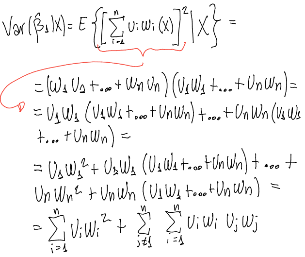{width="400"}

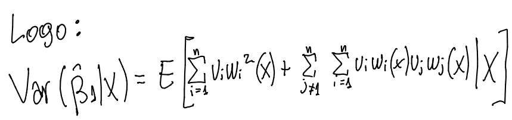{width="400"}

\justifying

### 2) d. {.unnumbered}

$$
\begin{aligned}
Var(\hat \beta_1|X)&=E\left[\sum_{i=1}^{N} u_{i}^{2} w_{i}(X)^{2}+\sum_{j \neq 1}^{N} \sum_{i=1}^{N} u_{i} w_{i}(X) u_{j} w_{j}(X)\Bigg|\ X \right] \\
&=(?)=\sum_{i=1}^{N} \sigma^{2} w_{i}(X)^{2}
\end{aligned}
$$

-   [ ] *(A) Hipótese de distribuição normal para o termo de perturbação*

-   [ ] *(B) Hipótese de homocedasticidade, apenas*

-   [x] *(C) Hipótese de homocedasticidade e ausência de autocorrelação*

\Centering

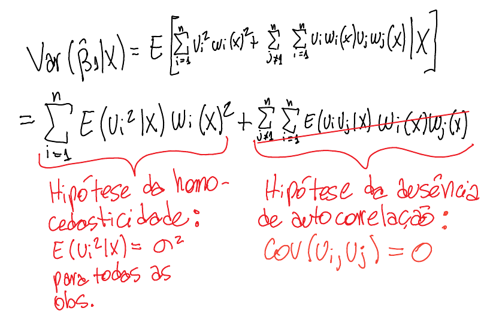{width="400"}

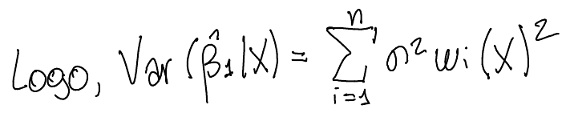{width="400"}

```{=tex}
\justifying
\setlength{\parindent}{0cm}
```
## 3) {.unnumbered}

*Um pesquisador considera dois procedimentos para prever o padrão de variação da variável remuneração ao longo de uma amostra de trabalhadores:*

1.  *A previsão pela média, ou seja, toma-se por base a média amostral da remuneração, assumindo-se, pois, que o nível salarial individual se mantém satisfatoriamente próximo de tal tendência central;*
2.  *A previsão pela regressão simples, ou seja, toma-se por base uma regressão simples em que a variável explicativa é o nível educacional, assumindo-se, pois, que este exibe padrão de variação satisfatoriamente próximo do observado para o nível de remuneração.*

*A qualidade da previsão gerada por cada maneira, ou seja, o desempenho de cada maneira, é medida a partir do erro quadrático médio, calculado como segue (Obs.: notar que as medidas são inversamente proporcionais ao grau de desempenho).*

$$
E Q M_{\text {média}}=\frac{1}{N} \sum_{i=1}^{N}\left(y_{i}-\bar{y}\right)^{2}
$$

$$
E Q M_{F R P}=\frac{1}{N} \sum_{i=1}^{N}\left(y_{i}-\widehat{\beta_{0}}-\widehat{\beta_{1}} x_{i}\right)^{2}
$$

### 3) a. {.unnumbered}

*Demonstre que o erro quadrático médio cometido pela regressão nunca é maior do que aquele cometido pela média. Ou seja, a primeira pode ter desempenho no mínimo equivalente à segunda, mas nunca inferior. Dica: a regressão atingiria o menor grau de desempenho possível no caso em que a correlação entre educação e remuneração na população e na amostra fosse nula. Tomando por base as fórmulas dos estimadores de MQO para os parâmetros, reconsidere a fórmula no interior do erro quadrático médio para a regressão como base para responder a este item.*

\Centering

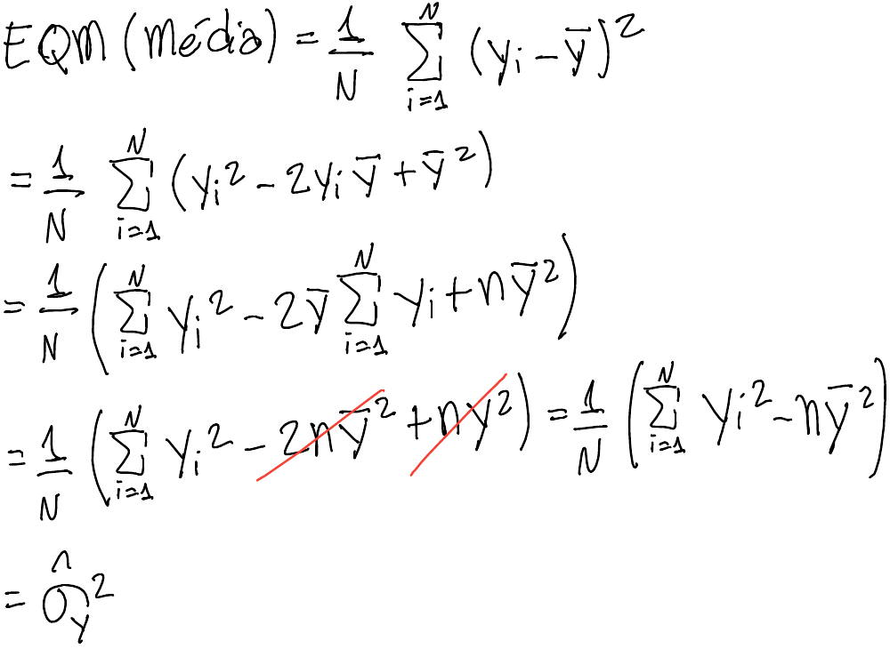{width="400"}

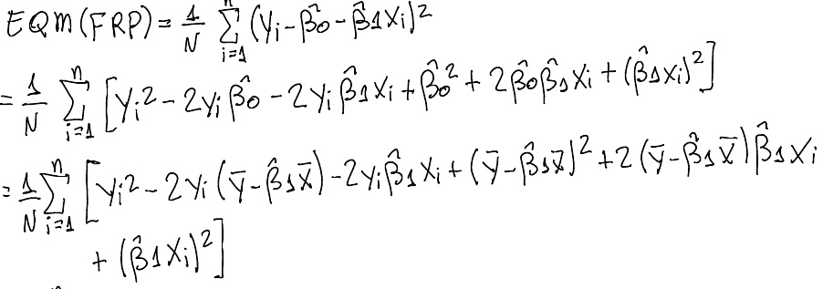{width="500"}

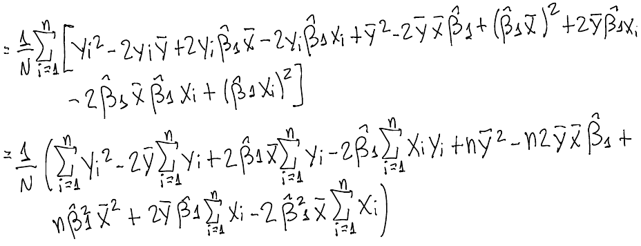{width="500"}

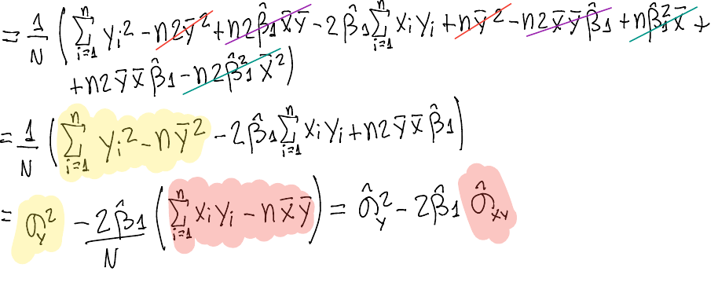{width="500"}

```{=tex}
\justifying
\setlength{\parindent}{0cm}
```
**Caso 1:** EQM~FRP~ = EQM~média~ $\leftrightarrow x_i-\bar x=0$, pois,

$$
\hat\beta^2_1\hat\sigma_x^2=\hat\beta^2\frac{\sum_{i=1}^{N}(x_i-\bar x)^2}{N}=\hat\beta^2\frac{0}{N}=0
$$

$$
2\hat\beta_1\hat\sigma_{xy}=2\hat\beta_1\frac{\sum_{i=1}^{N}(x_i-\bar x)(y_i-\bar y)}{N}=2\hat\beta_1\frac{\sum_{i=1}^{N}0(y_i-\bar y)}{N}=0
$$

**Caso 2:** EQM~FRP~ \< EQM~média~ $\leftrightarrow 2\hat\beta_1\hat\sigma_{xy}-\hat\beta_1^2\hat\sigma_x^2>0$, ou seja,

$$
\begin{aligned}
2\hat\beta_1\hat\sigma_{xy}&>\hat\beta_1^2\hat\sigma_x^2 \\
2\frac{\hat\sigma_{xy}}{\hat\sigma^2_{x}}\hat\sigma_{xy}&>\left(\frac{\hat\sigma_{xy}}{\hat\sigma^2_{x}}\right)^2\hat\sigma^2_{x} \\
2\frac{\hat\sigma_{xy}^2}{\hat\sigma^2_{x}}&>\frac{\hat\sigma_{xy}^2}{\hat\sigma^4_{x}}\hat\sigma^2_{x} \\
2\frac{\hat\sigma_{xy}^2}{\hat\sigma^2_{x}}&>\frac{\hat\sigma_{xy}^2}{\hat\sigma^2_{x}}
\end{aligned}
$$

Assim, EQM~FRP~ \< EQM~média~ $\forall (x_i,y_i)$.

**Caso 3:** EQM~FRP~ \> EQM~média~ $\leftrightarrow \hat\beta_1^2\hat\sigma_x^2-2\hat\beta_1\hat\sigma_{xy}>0$. No entanto, como provado no caso 2, $\hat\beta_1^2\hat\sigma_x^2>2\hat\beta_1\hat\sigma_{xy}$ não é um resultado possível.

Logo, EQM~FRP~ $\le$ EQM~média~ $\forall (x_i,y_i)$.

### 3) b. {.unnumbered}

*Considere a fórmula do coeficiente de determinação da regressão simples abaixo. Continuando o raciocínio utilizado na resposta ao item anterior, demonstre que a relação entre coeficiente de determinação e coeficiente de correlação entre educação (x) e remuneração (y) é positiva.*

$$
R^{2}=1-\frac{E Q M_{F R P}}{E Q M_{\text {média }}}=1-\frac{\sum_{i=1}^{N}\left(y_{i}-\hat{\beta_{0}}-\hat{\beta_{1}} x_{i}\right)^{2}}{\sum_{i=1}^{N}\left(y_{i}-\bar{y}\right)^{2}}
$$

\Centering

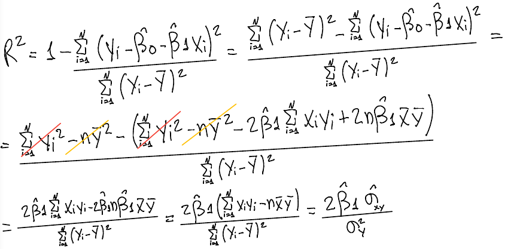{width="500"}

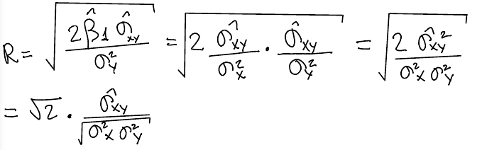{width="500"}

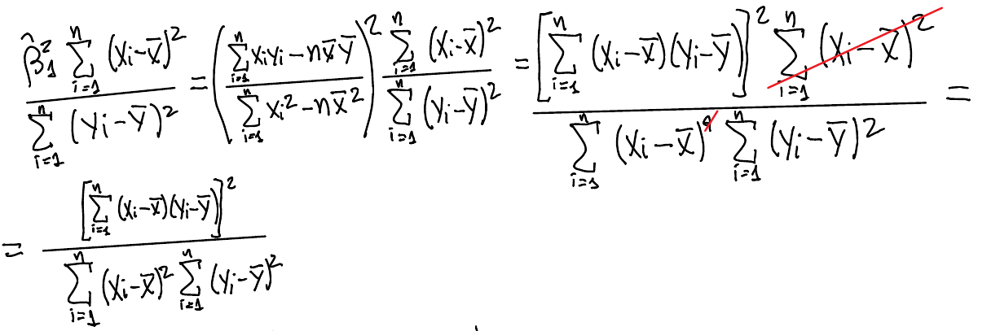{width="500"}

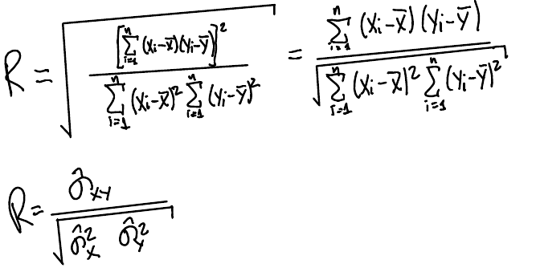{width="320"}

```{=tex}
\justifying
\setlength{\parindent}{0cm}
```
Assim, caso cov(x~i~, y~i~) \> 0, a relação entre o coeficiente de correlação e o de determinação será positiva.

### 3) c. {.unnumbered}

*Outra forma de entender a fórmula do coeficiente de determinação é escrevendo-a como segue:*

$$
R^{2}=1-\frac{E Q M_{F R P}}{E Q M_{\text {média }}}=1-\frac{\sum_{i=1}^{N}\left[y_{i}-\hat{E}\left(y\ |\ x=x_{i}\right)\right]^{2}}{\sum_{i=1}^{N}\left(y_{i}-y\right)^{2}}
$$

*Em que* $\hat{E}\left(y\ |\ x=x_{i}\right)$ = $y_{i}-\hat{\beta_{0}}-\hat{\beta_{1}} x_{i}$ *é a função de regressão amostral, tratando-se, pois, da contrapartida amostral da expectativa condicional. Com base nisso explique por que, havendo correlação considerável entre educação (x) e remuneração (y), a regressão simples em questão tende a apresentar um melhor desempenho preditivo do que a média incondicional. Sua resposta deve estar embasada na diferença conceitual entre média condicional, tal como se encontra no numerador da expressão, e média incondicional, esta contida no denominador. Leve em conta, adicionalmente, que a média condicional é calculada a partir de dois passos, o primeiro consistindo na seleção de um grupo amostral em função de um determinado nível educacional. Já o segundo compreende o cálculo da média exclusivamente para o grupo selecionado -- tal cálculo é repetido para todos os grupos amostrais.*

A regressão simples apresenta melhor desempenho preditivo pois não assume, havendo correlação entre variável dependente e variável independente, que os valores se distribuirão ao redor da média amostral. Utilizando a função de regressão amostral, ao se calcular a média condicional da variável dependente para cada valor da variável independente, leva-se em consideração a influência da variância da variável independente que, caso seja significativa, aproximará melhor os dados em uma reta de regressão, aumentando seu poder explicativo e preditivo.

## 4) {.unnumbered}

*Foi estimada, como parte de uma monografia do Bacharelado em Ciências Econômicas da UFABC, a regressão abaixo em que o déficit de altura para a idade de crianças de cinco anos, residentes em domicílios brasileiros, é explicado em função de características do domicílio e da criança. A variável dependente está medida em centímetros. (Obs.: nenhuma das variáveis está em forma logarítmica.)*

|                  Parâmetro                   | Estimativa pontual |
|:--------------------------------------------:|:------------------:|
|                  Intercepto                  |     3.4998133      |
|               Renda per capita               |     -0.002594      |
| Anos de estudo do responsável pelo domicilio |     -0.054417      |
|                Sexo feminino                 |     0.8879468      |
|               Idade (em meses)               |     0.0157118      |
|        Acesso à abastecimento hídrico        |     -0.285436      |
|                  Área rural                  |     0.2625615      |
|                 Região Norte                 |     1.3930684      |
|               Região Nordeste                |     0.0366229      |
|             Região Centro-Oeste              |     -0.241068      |
|                Região Sudeste                |     -0.449075      |

: Coeficientes da regressão

*Obs.: foram omitidas as estimativas pontuais para as seguintes variáveis: status do domicílio em relação à conexão à rede de suprimento de eletricidade, à rede de esgoto e acesso a serviços de saúde.*

### 4) a. {.unnumbered}

*Qual é o significado do valor numérico da estimativa pontual para o sexo feminino? Para responder:*

1.  *Apresente a definição formal do coeficiente em questão tomando por base a diferença entre as expectativas condicionais da variável dependente referentes a cada um dos dois grupos sociais em questão, ceteris paribus nas demais variáveis independentes.*

    -   $E(Y|X, \text{d\_feminino} = 0) = \beta_0+\beta_1X$ representando observações do sexo masculino

    -   $E(Y|X, \text{d\_feminino} = 1) = \beta_0+\beta_1X+\beta_2\delta$ representando observações do sexo feminino ($\delta$)

\Centering

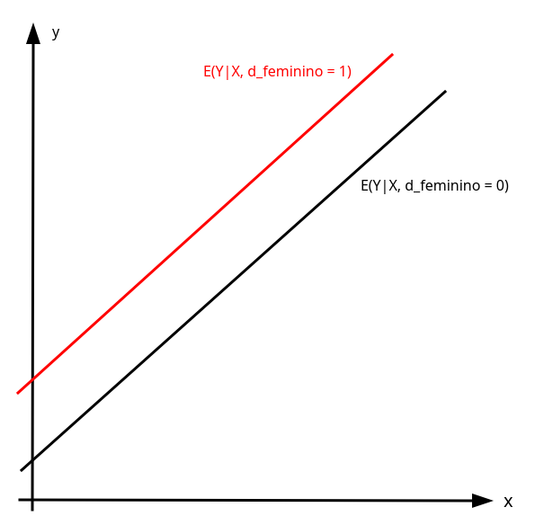{width="300"}

```{=tex}
\justifying
\setlength{\parindent}{0cm}
```
2.  *Com base no passo anterior, escreva, textualmente, a interpretação da magnitude numérica da estimativa pontual.\
    \
    *O coeficiente de aproximadamente 0,89 para o sexo indica que, em média, indivíduos do sexo feminino possui 0,89 centímetros a mais de déficit de altura para a idade de crianças de cinco anos, residentes em domicílios brasileiros.

### 4) b. {.unnumbered}

*Qual é o significado do valor numérico da estimativa pontual para a região Norte? Para responder:*

1.  *Apresente a definição formal do coeficiente em questão tomando por base a diferença entre as expectativas condicionais da variável dependente referentes aos grupos regionais em questão, ceteris paribus nas demais variáveis independentes.*

    \scriptsize

    +--------+------------+------------+------------+------------+----------------------------------------------------+-------------------------------------+
    |        | $\delta_1$ | $\delta_2$ | $\delta_3$ | $\delta_4$ | $E(Y|X)$                                           | Equação                             |
    +:======:+:==========:+:==========:+:==========:+:==========:+====================================================+=====================================+
    | S      | 0          | 0          | 0          | 0          | $E(Y|X, \delta_1=\dots=\delta_4=0)$                | $=\beta_0+\beta_1X$                 |
    +--------+------------+------------+------------+------------+----------------------------------------------------+-------------------------------------+
    | N      | 1          | 0          | 0          | 0          | $E(Y|X, \delta_1=1, \delta_2=\delta_3=\delta_4=0)$ | $=\beta_0+\beta_1X+\beta_2\delta_1$ |
    +--------+------------+------------+------------+------------+----------------------------------------------------+-------------------------------------+
    | NE     | 0          | 1          | 0          | 0          | $E(Y|X, \delta_2=1, \delta_1=\delta_3=\delta_4=0)$ | $=\beta_0+\beta_1X+\beta_3\delta_2$ |
    +--------+------------+------------+------------+------------+----------------------------------------------------+-------------------------------------+
    | CO     | 0          | 0          | 1          | 0          | $E(Y|X, \delta_3=1, \delta_1=\delta_2=\delta_4=0)$ | $=\beta_0+\beta_1X+\beta_4\delta_3$ |
    +--------+------------+------------+------------+------------+----------------------------------------------------+-------------------------------------+
    | SE     | 0          | 0          | 0          | 1          | $E(Y|X, \delta_4=1, \delta_1=\delta_2=\delta_3=0)$ | $=\beta_0+\beta_1X+\beta_5\delta_4$ |
    +--------+------------+------------+------------+------------+----------------------------------------------------+-------------------------------------+

    : Matriz de dummies

    \normalsize

    Onde X representa as demais variáveis da regressão.

2.  *Com base no passo anterior, escreva, textualmente, a interpretação da magnitude numérica da estimativa pontual.\
    \
    *O coeficiente de aproximadamente 1,4 para a região Norte indica que, em média, residentes da região norte possuem 1,4 centímetros a mais de déficit de altura para a idade de crianças de cinco anos, residentes em domicílios brasileiros, em comparação com a região de referência (Sul).

### 4) c. {.unnumbered}

*Agora, tomando o coeficiente da renda domiciliar per capita, uma variável medida em Reais (R\$), explique o significado da estimativa pontual correspondente. Continue a tomar por base uma comparação entre dois grupos sociais equivalentes em todas as demais variáveis.*

O coeficiente para variáveis contínuas representa o efeito de uma variação na variável independente na variável dependente, ou seja, $\Delta y_i=\beta_i\Delta x_i$.

O coeficiente da variável "renda domiciliar *per capita"* indica que, *ceteris paribus*, um aumento na renda leva a uma diminuição do déficit de altura para a idade de crianças de cinco anos em -0,0026.
